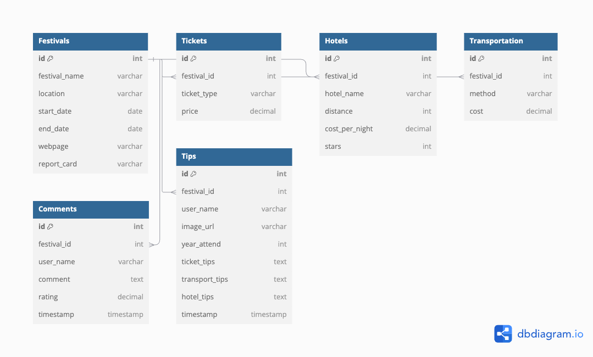

# Project Title 
Festication Planning (Name in Progress)

## Overview
- Centralized web application to provide user with all the starting information to start planning their festication. 
- Festication = festival + vacation 

### User Profile 
- Festival Goers: 
    - looking for a one-stop shop for information gathering/reserach (price, dates, accomodations availability, transportation options) for their favourite festival 
    - looking to see all the festivals available in the location of their choice in an easy to digest way (calendar view or list)
    - Looking for a edm-centric community to share tips, advice and rating for each festival. 

### Problem 
With FyreFestival and other quick money grab festivals running along side some of the biggest commercialized festival such as Electric Daisy Carnival or Tomorrowland, consumers have too many options when it comes to picking a festival. Not all will be a good experience or smooth sailing when it comes to the logistics aspect. Festication Planning will provide a one stop shop of information gathering to get the festival goer on the right path when choosing a festival that meets their criteria, and an overview of the logistics that they would need to plan our the perfect festival vacation.  

### Feature

- As a user, I want to be able to find festivals and the respective details in any given location.
- As a user, I want to be able to view a list of festivals that I want to go to in a visually appealing and organized way. 
- As a user, I want to be able to find the highest-rated festivals within a certain distance from any given location

- As a user, I want to be able to rate the festival and provide reviews for a festival I have gone to. 
- As a user, I want to be able to read ratings and reviews for a festival of my choice.
- As a user, I want to be able to view tips and tricks for a festival of my choice. 
- As a user, I want to be able to provide tips and tricks for a festival of my choice. 


## Implementation 

### Tech Stack 
- React 
- Javascript 
- MySQL
- Express
- Client libraries: 
    - react
    - react-router
    - axios
    - react-calendar 
- Server libraries:
    - knex
    - express

### APIs
- No external APIs will be used. 

### Sitemap
- home page 
- Festivals listing
- Festival Details 
    - Festival rate and comment section 
- Festival tips and tricks (forum style)
- Festival tips and tricks upload page


### Endpoints 

**GET /festivals** 
- get listing of all the festivals and their details 

parameters:
- optional: user-selected location from given opens (United States, Canada, Europe..etc)

Example Response:
```
[ 
    {
        "id": 1,
        "festival_name": EDC, 
        "location": Las Vegas,
        "start-date: 16/05/2025,
        "end-date: 18/05/2025,
        "report_card": A-,
    }
]
```

**GET /festivals/:id**
- get festival by id
- information will be used to populate the festival details page, covering the basic overview 

Example response: 
```
[
    {
        "id": 1,
        "festival_name": "EDC", 
        "location": "Las Vegas",
        "start-date": 16/05/2025,
        "end-date": 18/05/2025,
        "webpage": "https://lasvegas.electricdaisycarnival.com/",
        "report_card": A-,
        "ticket_type": [
            {
                "GA": 450,
                "GAplus": 700,
                "VIP": 1200
            }
        ],
        "hotel": [
            {
                "hotel_name": "Hilton",
                "distance": 23,
                "cost_per_night": 350,
                "stars": 4
            },
            {
                "hotelName": "Marriott"
                "distance": 20,
                "cost_per_night": 380,
                "stars": 4
            }
        ]
        "transporation": [
            {
                "method": "Uber",
                "transportCost": 600
            },
            {
                "method": "Shuttle",
                "transportCost": 150,
            },
            {
                "method": "car rental",
                "transportCost": 300
            }
        ]
        "comment": [
            {
                "user_name": "Jane Doe",
                "comment": "This festival was really fun, has very good crowd control, and it got the best lineup",
                "rating": 4.5,
                "timestamp": 1705084427000
            },
            {
                "user_name": "John Doe",
                "comment": "This festival does not care about their attendees, long shuttle lines, limited access to water, it spend all their money on the artists, and zero money on safety.",
                "rating": 3
                "timestamp": 1705084427000
            }
        ]
    }
]
```

**POST /festivals/:id/comment** 
- Users can give a festival rating and a comment/review

Response 
```
{
    "id": 1,
    "name": "Jane Doe",
    "comment": "This festival was really fun, has very good crowd control, and it got the best lineup",
    "rating": 4.5,
    "timestamp": 1705084427000
}
```
**GET /festivals/:id/tips**
- Users can view a blog-like/forum-like style of users-provided tips and tricks for planning, the initial data will be data provided by Festication Planning based on the team's own research

Example Response
```
{
    "id": 1
    "name": Jane Doe
    "festival_name": EDC,
    "image_url": funimageatfestival.jpg
    "timestamp":
    "year_attend": 2023,
    "tips": [
        {
            "ticketTips": "tips to buy ticket goes here",
            "transportTips": "Uber is the best option",
            "hotelTips": "Don't book airbnb, they cancel on you",
        }
    ]
}
 ```

**POST /festivals/:id/tips**
- Users can post their own tips and tricks

Example Response
```
{
    "id": 1
    "name": Jane Doe
    "festival_name": EDC,
    "image_url": funimageatfestival.jpg
    "timestamp":
    "year_attend": 2023,
    "tips": [
        {
            "ticketTips": "tips to buy ticket goes here",
            "transportTips": "Uber is the best option",
            "hotelTips": "Don't book airbnb, they cancel on you",
        }
    ]
}
 ```

**PUT /festivals/:id/tips**
- Users can edit their own tips and tricks post 
Example Response
```
{
    "id": 1
    "name": Jane Doe
    "festival": EDC,
    "image": funimageatfestival.jpg
    "timestamp":
    "yearAttend": 2023,
    "tips": [
        {
            "ticketTips": "tips to buy ticket goes here",
            "transportTips": "Uber is the best option",
            "hotelTips": "Don't book airbnb, they cancel on you",
        }
    ]
}
```
### Data


### Home Page
- Design in progress (front-end to be iterated during building)
- Note. Design mockup using Canva template therefore there will be visual design changes when building out Festication Planning


### Festival-listing 
- Design in progress (front-end to be iterated during building)
- Note. Design mockup using Canva template therefore there will be visual design changes when building out Festication Planning 
- The hero would have a calendar providing overview of upcoming festivals 
- each card for festival listing will provide basic information
- the listing would include all festivals within the database


### Festival-Details 
- Design in progress (front-end to be iterated during building)
- Note. Design mockup using Canva template therefore there will be visual design changes when building out Festication Planning 
- Festival detail page will contain logistics information (ticket costs, hotels, and transportation) for the festival that the user has selected. 
- Note. Design mockup using Canva template therefore there will be visual design changes when building out Festication Planning


### Comment-section 
- Continuation of the Festival-Details page - they will be on the same "page" (scrolling to this section)
- It will show the comments available so far, and allow the users to add their own comments 
- Note. Design mockup using Canva template therefore there will be visual design changes when building out Festication Planning


### Tips and Tricks 
- a page dedicated to user-provided tips and tricks for each festival, this will be blog/forum-style 
- card dedicated to each input, each input will have the festival name, the user name, and year that the user attended, and the 3 dedicated tips 
- Note. Design mockup using Canva template therefore there will be visual design changes when building out Festication Planning


### Tips and Tricks - form 
- a form page that allow the users to post their tips and tricks
- Note. Design mockup using Canva template therefore there will be visual design changes when building out Festication Planning


## Roadmap
- Create client
    - react project with routes and boilerplate pages
    - gather pictures/assets/fonts

- Create server
    - express project with routing, with placeholder 200 responses

- Create migrations

- Gather festivals data (starting 15, ideally 30)

- Create seeds with sample festival data

- Create header

- Create homepage 
    - Note where links/useNavigate are needed 

- Create festival listing page 
    - front-end: html structure 
    - GET /festivals
    - functionality component 
    - fix up styling

- Create festival details page
    - GET /festivals/:id
    - front-end: html structure
    - functionality component 
    - fix up styling

- Create comment section of festival details page 
    - POST backend to add comments 
    - GET backend to show comments 
    - front-end: html structure
    - functionality component 
    - fix up styling

- create tips and tricks page 
    - GET backend to pull tips and tricks infromation 
    - front-end: html structure
    - functionality component 
    - fix up styling

- create tips and tricks form page 
    - POST backend to add tips and tricks 
    - front-end: html structure
    - functionality component 
    - fix up styling

- TESTING and Bug fixes
- overall styling fixes 


- DEMO DAY


## Nice-to-have
- edit funciton for comments and tips and tricks 
- interactive calendar 
- ability to add festivals 
